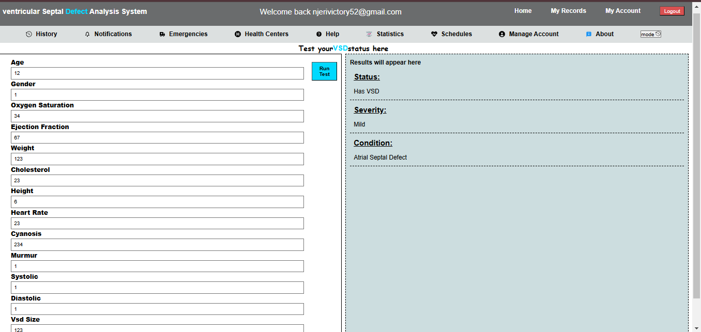

# VSD Recognition and Treatment Recommendation System

## 📌 Overview

This project is an AI-powered system designed to recognize Ventricular Septal Defect (VSD) and other heart conditions. It provides medical professionals with treatment recommendations based on the detected condition. The system integrates **Flask** (backend) and **JavaScript** (frontend) with a **machine learning model** to analyze patient data.

## 🎯 Features

- ✅ **VSD Detection:** Uses machine learning to identify VSD in patients.
- ✅ **Heart Condition Recognition:** Can detect other related heart diseases.
- ✅ **Treatment Recommendation:** Provides suggested treatments based on the diagnosis.
- ✅ **User-Friendly Interface:** Developed using JavaScript for a seamless experience.
- ✅ **API Integration:** Flask-powered API for backend processing.

## 🏗️ Technologies Used

- **Frontend:** JavaScript, React (optional), HTML, CSS
- **Backend:** Flask, Python
- **Machine Learning:** Scikit-Learn, TensorFlow/Keras (depending on model used)
- **Database:** SQLite/PostgreSQL
- **Deployment:** Vercel (Frontend), Flask Server (Backend)

## 🖥️ System Architecture

```
User ➝ Frontend (JS) ➝ Flask API ➝ ML Model ➝ Diagnosis & Recommendation
```

## 🚀 Installation & Setup

### 1️⃣ Clone the Repository

```bash
 git clone https://github.com/Viniek/VSD.git
 cd VSD
```

### 2️⃣ Install Backend Dependencies

```bash
 cd backend
 pip install -r requirements.txt
```

### 3️⃣ Run Flask Server

1).Open git bash

2.)Navigate to the directory of your flask file.

3.)Run python app.py

```bash
 python app.py
```


### 4️⃣ Install Frontend Dependencies

```bash
 cd ../frontend
 npm install
```

### 5️⃣ Start Frontend

Run npm run start

```bash
  npm start
```

1.)Navigate to your Client directory

2.)Run npm run dev


## 📸 Screenshots

Login Page




## 🎥 Demo Video

[Click here to watch the demo](videos/demo.mp4)

## 🛠️ Future Improvements

- 🔄 Improve model accuracy with more data.
- 🏥 Integrate with hospital databases.
- 📈 Provide real-time monitoring for critical patients.

## 🤝 Contributing

We welcome contributions! Feel free to fork the repo, create a branch, and submit a pull request.

## 📝 License

This project is licensed under the MIT License. See the [LICENSE](LICENSE) file for details.

---

🔗 **Repository:** [GitHub - Viniek/VSD](https://github.com/Viniek/VSD)
